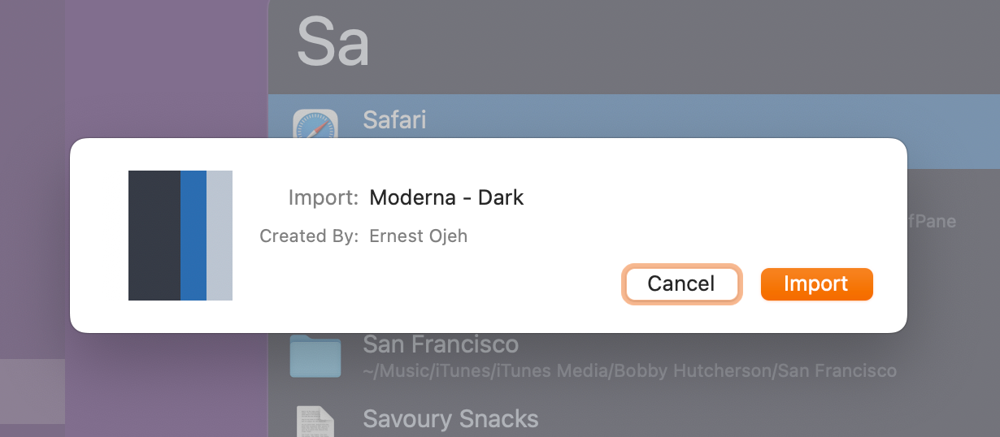
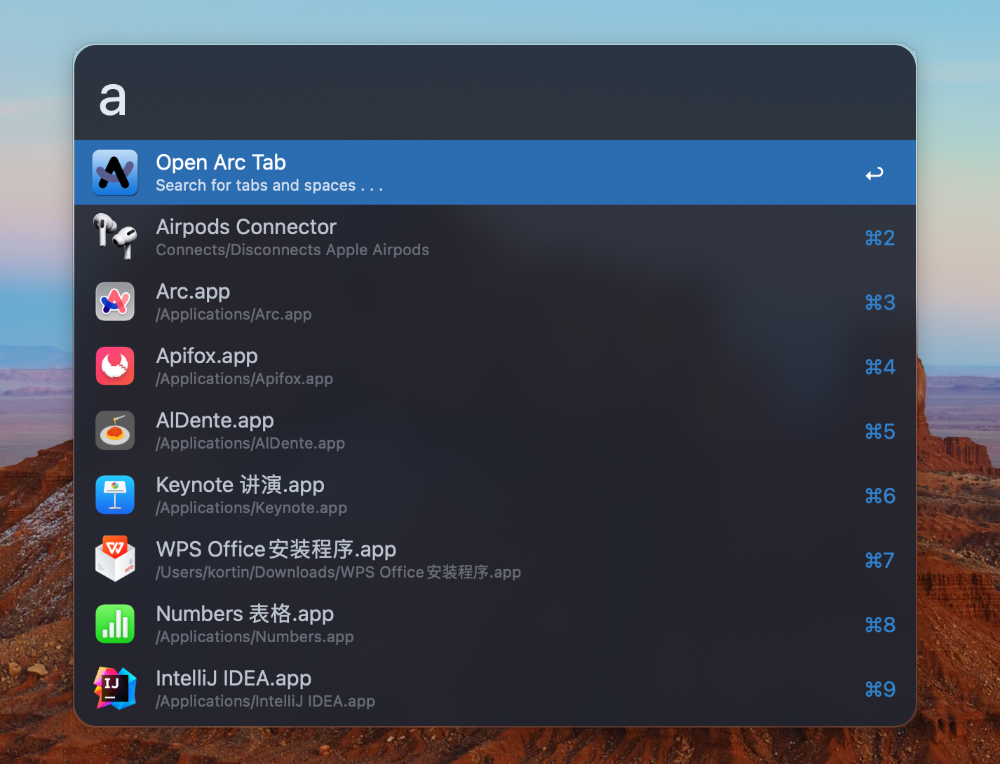
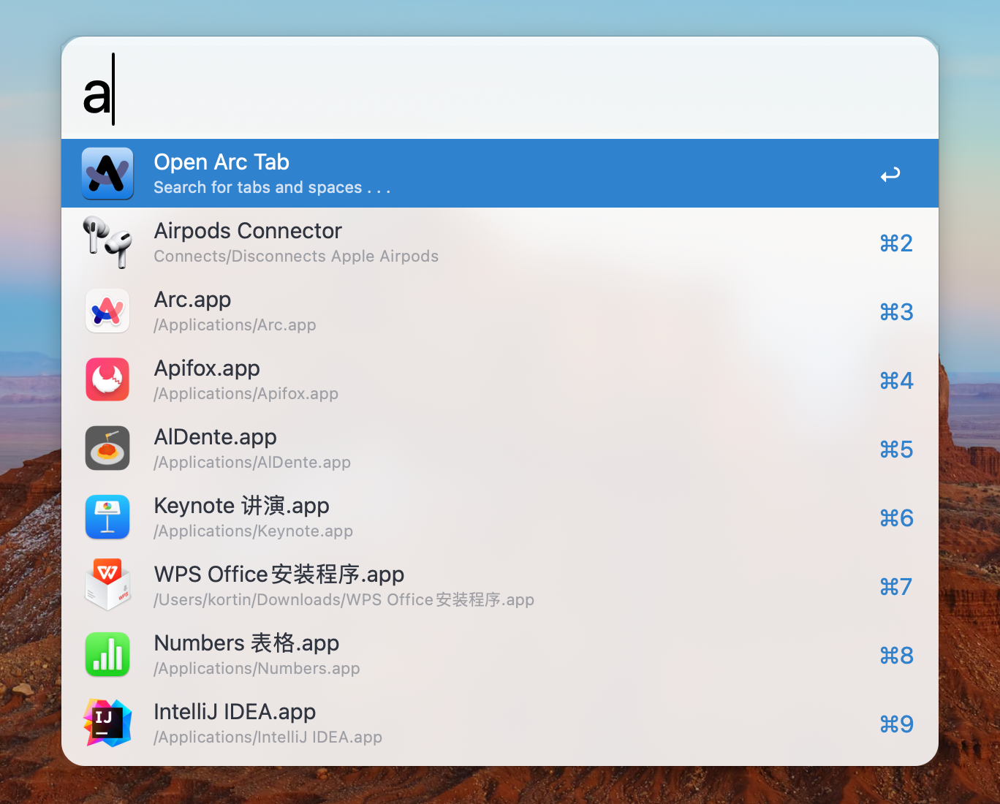

# Alfred
自用 Alfred 主题和 workflow 推荐
> 我现在使用 [Raycast](https://www.raycast.com/) 替代了 Alfred，仓库不再更新。只是因为作为前端工程师 Raycast 更适合我，但是 Alfred 是一个强大且自定义程度很高的工具，仍然推荐大家使用。

## Usage
下载当前仓库到本地，双击需要的主题或 workflow，即可直接唤起 Alfred 进行安装。

## Themes
- Moderna - Dark

- Moderna - Light

## Workflows
- `Visual Studio Code`

  使用 VSCode 查找并打开项目或文件

- `VSCode Diff`

  使用 VSCode 开启 diff 对比

- `Chromium Bookmarks and History Search`

  使用 Alfred 打开 Chromium 内核浏览器收藏的书签或历史记录

- `Google Suggest`

  在 Alfred 中使用 Google 搜索时附带搜索提示

- `Things`

  更快捷地进行 Todo
